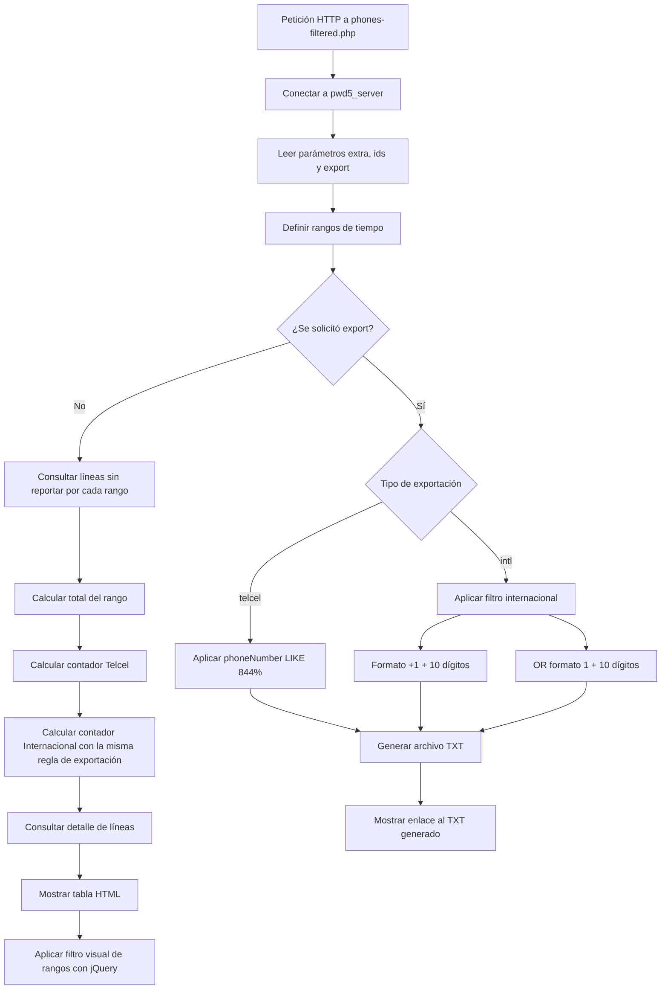

# Diagrama funcional — phones-filtered



## Regla internacional de la versión 1.7

```sql
(
    phoneNumber REGEXP '^[+]1[0-9]{10}$'
    OR phoneNumber REGEXP '^1[0-9]{10}$'
)
```

La condición es un `OR`: basta con que el número cumpla uno de los dos formatos.
