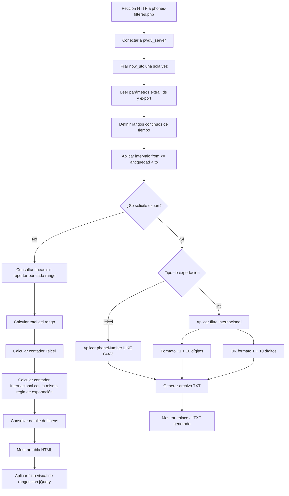

# Diagrama funcional — phones-filtered v1.10


```mermaid
flowchart TD
	A[Petición HTTP a phones-filtered.php] --> B[Conectar a pwd5_server]
	B --> B1[Fijar now_utc una sola vez]
	B1 --> C[Leer parámetros extra, ids y export]
	C --> D[Definir rangos continuos de tiempo]
	D --> D1[Aplicar intervalo from <= antigüedad < to]
	D1 --> E{¿Se solicitó export?}

	E -- No --> J[Consultar líneas sin reportar por cada rango]
	E -- Sí --> F{Tipo de exportación}

	F -- telcel --> G[Aplicar phoneNumber LIKE 844%]
	F -- intl --> H[Aplicar filtro internacional]

	H --> H1[Formato +1 + 10 dígitos]
	H --> H2[OR formato 1 + 10 dígitos]

	G --> I[Generar archivo TXT]
	H1 --> I
	H2 --> I

	J --> K[Calcular total del rango]
	K --> L[Calcular contador Telcel]
	L --> M[Calcular contador Internacional con la misma regla de exportación]
	M --> N[Consultar detalle de líneas]
	N --> O[Mostrar tabla HTML]

	I --> P[Mostrar enlace al TXT generado]
	O --> Q[Aplicar filtro visual de rangos con jQuery]
```

## Rangos de tiempo de la versión 1.10

```text
[10, 60)
[60, 120)
[120, 180)
[180, 240)
[240, 300)
[300, 360)
[360, 1440)
```

La versión 1.10 fija una sola referencia UTC al inicio:

```php
$now_utc = gmdate('Y-m-d H:i:s');
```

En SQL los rangos se implementan usando siempre ese mismo timestamp:

```sql
reportDate <= ADDDATE('$now_utc', INTERVAL -$from MINUTE)
AND reportDate > ADDDATE('$now_utc', INTERVAL -$to MINUTE)
```

Esto hace que cada frontera pertenezca a un solo rango, que no existan huecos y que un registro no pueda cambiar de periodo durante la misma ejecución por el paso del tiempo entre consultas.

## Regla internacional

```sql
(
	phoneNumber REGEXP '^[+]1[0-9]{10}$'
	OR phoneNumber REGEXP '^1[0-9]{10}$'
)
```

La condición es un `OR`: basta con que el número cumpla uno de los dos formatos.
